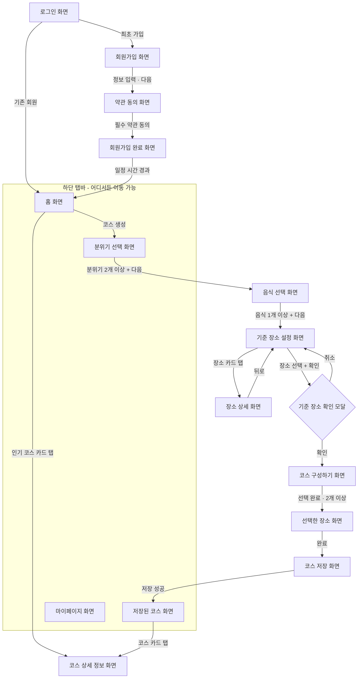

# 투데잇 (TODAIT) — Android

> **당신의 취향으로 완성되는 오늘의 데이트**
>
> 투데잇은 사용자가 선택한 취향(분위기·음식)과 기준 장소를 바탕으로 주변 데이트 장소를 추천하고,
> 사용자가 직접 데이트 코스를 구성·저장할 수 있도록 돕는 **데이트 코스 설계 서비스**입니다.
> 초기 지원 지역: **홍대 · 연남 · 성수**

- Backend Repository: [UMC-TODAIT/TODAIT_BE](https://github.com/UMC-TODAIT/TODAIT_BE)

---

## 👥 팀원 소개 및 역할 분담

| 이름 | GitHub | 담당 영역 |
| --- | --- | --- |
| 티아/강서윤 | [@CreamMatcha](https://github.com/CreamMatcha) | 기준 장소 설정, 코스 구성하기, 지도(핀·도보 경로) 연동, 코스 저장 |
| 무즈/김규리 | [@kyureekimm](https://github.com/kyureekimm) | 로그인/회원가입, 홈,취향 설정(분위기·음식)  |
| 지니/황지희 | [@jihui0523](https://github.com/jihui0523) | 저장된 코스/상세, 마이페이지, 로딩/에러/빈 상태 공통 컴포넌트 |

> 공통: API 연동은 각자 담당 화면 기준, 디자인 시스템·공통 컴포넌트는 PR 리뷰로 함께 관리합니다.

---

## 🛠 기술 스택

| 구분 | 내용 |
| --- | --- |
| 언어 | Kotlin 2.2 |
| UI | Jetpack Compose (Material 3) |
| 아키텍처 | MVVM + 단방향 데이터 흐름(UiState/UiEvent), 단일 모듈 · feature 패키지 분리 |
| 비동기 | Coroutines · Flow |
| DI | Hilt |
| 네트워크 | Retrofit2 · OkHttp3(Logging Interceptor) · Gson |
| 네비게이션 | Navigation Compose |
| 이미지 | Coil |
| 지도 | Naver Map SDK (Compose) |
| 인증 | Kakao Login SDK |
| 협업 | GitHub Flow · Issue/PR 템플릿 · 코드 리뷰 |

---

## 📁 프로젝트 폴더 구조

```
app/src/main/java/com/umc/todait
├── TodaitApplication.kt        # @HiltAndroidApp
├── MainActivity.kt             # 단일 Activity + Compose 진입점
├── core
│   ├── base                    # BaseViewModel, UiState 등 공통 베이스
│   └── network                 # BaseResponse, ApiResult, safeApiCall, UiError
├── di                          # Hilt 모듈 (NetworkModule 등)
├── navigation                  # Screen(라우트 정의), TodaitNavHost, BottomBar
├── ui
│   ├── theme                   # Color / Typography / Theme (디자인 시스템)
│   └── component               # 공통 컴포저블 (버튼, 카드, 태그 칩 등)
└── feature                     # 화면(기능) 단위 패키지
    ├── auth                    # 로그인, 회원가입, 약관 동의, 회원가입 완료
    ├── home                    # 홈
    ├── course                  # 취향 설정 → 기준 장소 → 코스 구성 → 저장
    ├── saved                   # 저장된 코스, 코스 상세
    └── mypage                  # 마이페이지
```

각 feature 패키지 내부는 `xxxScreen.kt / xxxViewModel.kt / xxxUiState.kt (+ data)` 구성을 기본으로 합니다.
자세한 규칙은 [컨벤션 문서](./docs/CONVENTION.md)의 "패키지 구조 규칙"을 참고하세요.

---

## 📄 컨벤션 문서

브랜치 네이밍 · 커밋 메시지 · PR 규칙 · 코드 네이밍 · 패키지 구조 규칙은 아래 문서에서 관리합니다.

👉 **[docs/CONVENTION.md](./docs/CONVENTION.md)**

---

## 🚀 빌드 및 실행 방법

### 요구 환경
- Android Studio **Otter 3 Feature Drop (2025.2.3) 이상** (AGP 9.1.1 요구 버전)
- JDK **17**
- Gradle **9.3.1** (Gradle Wrapper 포함, 별도 설치 불필요)
- minSdk **26** / targetSdk **36**

### 실행
```bash
git clone https://github.com/UMC-TODAIT/TODAIT_AOS.git
cd TODAIT_AOS
```
1. Android Studio에서 프로젝트 열기 → Gradle Sync
2. 루트에 `local.properties` 생성 후 SDK 경로 및 API 키 추가
   ```properties
   sdk.dir=<Android SDK 경로>
   BASE_URL="https://api.todait.example.com/"   # 백엔드 배포 후 교체
   NAVER_MAP_CLIENT_ID=<발급 키>
   KAKAO_NATIVE_APP_KEY=<발급 키>
   ```
3. `app` 구성으로 Run ▶ (에뮬레이터 또는 실기기)

> ⚠️ API 키는 절대 커밋하지 않습니다. `local.properties`는 `.gitignore`에 포함되어 있습니다.

---

## 📱 화면 목록 & 담당자

| 화면 이름 | 스크린 ID | 진입 경로 | 담당자 |
| --- | --- | --- | --- |
| 로그인 화면 | `LoginScreen` | 앱 최초 진입 / 세션 만료 시 | 무즈/김규리 |
| 회원가입 화면 | `SignupScreen` | 카카오 로그인 최초 가입 시 | 무즈/김규리 |
| 약관 동의 화면 | `TermsAgreementScreen` | 회원가입 화면 [다음] | 무즈/김규리 |
| 회원가입 완료 화면 | `SignupCompleteScreen` | 약관 동의 완료 시 | 무즈/김규리 |
| 홈 화면 | `HomeScreen` | 로그인 완료 후 / 하단 탭 [홈] | 무즈/김규리 |
| 분위기 선택 화면 | `MoodSelectScreen` | 홈 [코스 생성] 버튼 / 하단 탭 [코스 생성] | 무즈/김규리 |
| 음식 선택 화면 | `FoodSelectScreen` | 분위기 2개 이상 선택 → [다음] | 무즈/김규리 |
| 기준 장소 설정 화면 | `BasePlaceScreen` | 음식 1개 이상 선택 → [다음] | 티아/강서윤 |
| 장소 상세 화면 | `PlaceDetailScreen` | 기준 장소 설정 화면에서 장소 카드 탭 | 티아/강서윤 |
| 기준 장소 확인 모달 | `BasePlaceConfirmDialog` | 기준 장소 설정 화면에서 장소 선택 후 [확인] | 티아/강서윤 |
| 코스 구성하기 화면 | `CourseComposeScreen` | 기준 장소 확인 모달 [확인] | 티아/강서윤 |
| 선택한 장소 화면 | `SelectedPlacesScreen` | 코스 구성하기 [선택 완료] (기준 장소 포함 2개 이상) | 티아/강서윤 |
| 코스 저장 화면 | `CourseSaveScreen` | 선택한 장소 [완료] | 티아/강서윤 |
| 저장된 코스 화면 | `SavedCoursesScreen` | 코스 저장 성공 후 / 하단 탭 [저장된 코스] | 지니/황지희 |
| 코스 상세 정보 화면 | `CourseDetailScreen` | 저장된 코스 카드 탭 / 홈 인기 코스 카드 탭 | 지니/황지희 |
| 마이페이지 화면 | `MyPageScreen` | 하단 탭 [마이페이지] | 지니/황지희 |
| 로딩 / 에러 / 빈 상태 공통 컴포넌트 | `LoadingIndicator` / `ErrorContent` / `EmptyContent` | 전 화면 공통 (네트워크 로딩·에러·빈 상태 표시) | 지니/황지희 |

---

## 🗺 화면 이동 흐름 (Navigation Flow)



**텍스트 요약 (기본 플로우)**

```
로그인 → (최초 가입 시 회원가입 → 약관 동의 → 회원가입 완료) → 홈
→ 코스 생성 → 분위기 선택(2개↑) → 음식 선택(1개↑)
→ 기준 장소 설정 (장소 카드 탭 → 장소 상세) → 장소 선택 → 기준 장소 확인 모달(확인)
→ 코스 구성하기(카테고리별 추천 + 지도 핀/도보 경로)
→ 선택한 장소(순서 드래그 수정) → 코스 저장(이름/메모/태그)
→ 저장된 코스 → 코스 상세 정보
```

**주요 예외 분기**
- 지원 지역(홍대·연남·성수) 외 장소를 기준 장소로 선택 → 코스 생성 진행 불가, 안내 메시지 표시
- 기준 장소만 선택된 상태로 저장 단계 이동 불가 → "최소 1개 이상의 추가 장소가 필요합니다."
- 로그인 만료 → 어느 화면에서든 로그인 화면으로 이동
- 도보 경로 조회 실패 → 번호 핀 + 단순 연결선으로 대체 (흐름 중단 없음)
